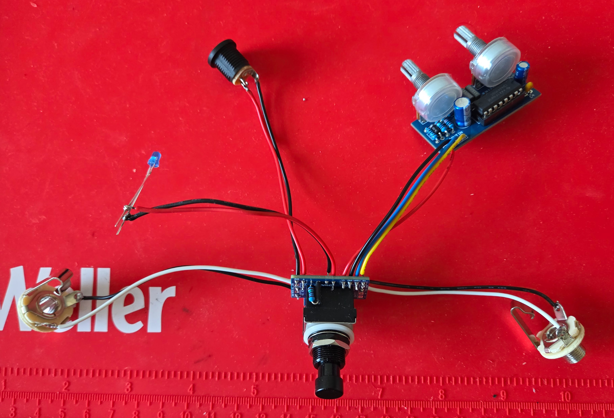
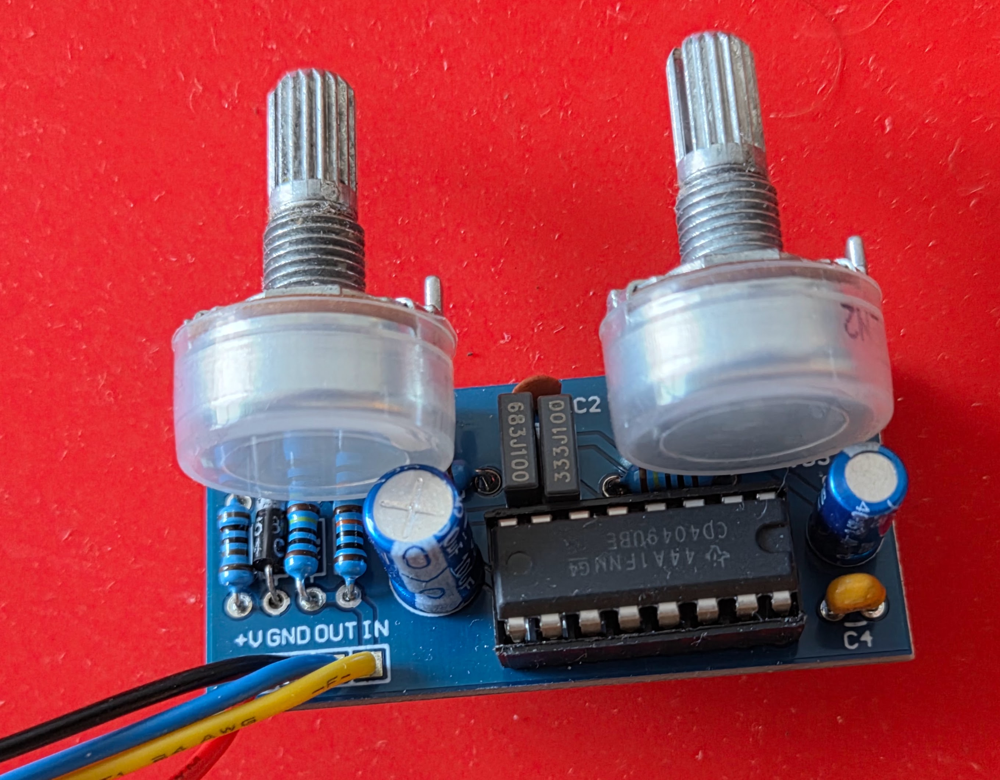
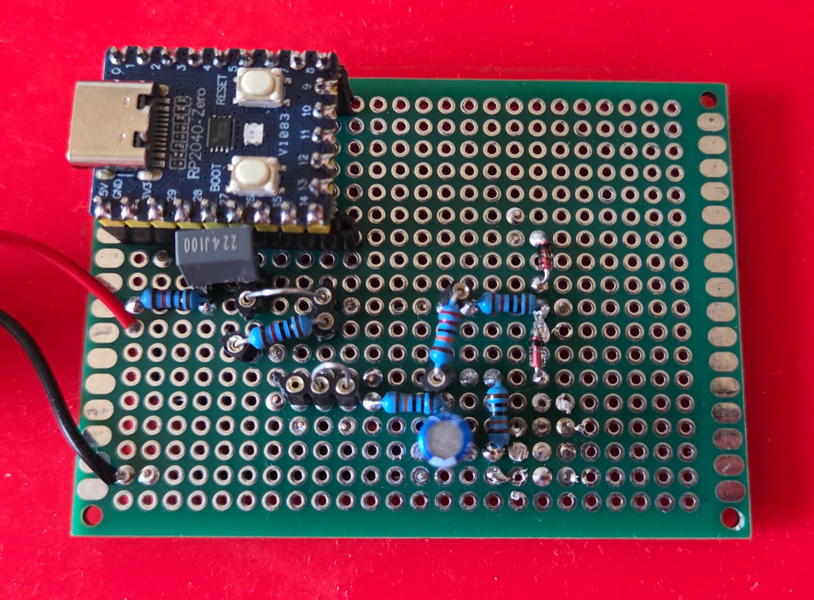
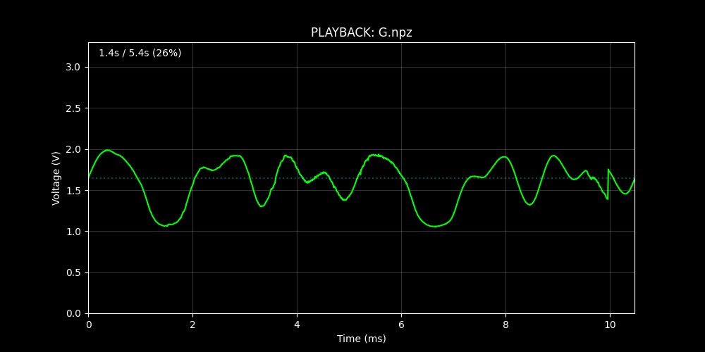

# ⚡ systems-audio-lab

**From Python to Silicon**


A complete electronics workbench built from scratch to measure and analyze audio circuits. Rather than buying test equipment, this project builds the entire measurement chain: a parts management system, clean power supply, test circuit, and custom oscilloscope.

This repository documents the full process from component ordering through frequency response analysis, spanning software logistics, power regulation, embedded firmware, and signal processing.

### 📄 [Read the Full Engineering Report (PDF)](docs/systems_audio_tech_report.pdf)
*A detailed technical report covering the design process, thermal analysis, and measurement validation.*

---

## 🚧 Current Status: Implementing Transfer Function Analysis

Hardware and basic signal analysis are **complete and validated**. Transfer function analysis is under active development.

* **Completed:** Waveform capture, harmonic analysis confirming soft-clipping topology and harmonic asymmetry (Notebooks `01` & `02`).
* **In Progress:** Implementing **Exponential Sine Sweep (ESS) deconvolution** in Notebook `04` to separate linear frequency response from harmonic distortion components, enabling automated Bode plot generation.

---

## 🔬 Key Findings: Measuring "Tube Sound"

The primary goal was to test whether **CMOS inverter chips** (normally used for digital logic), when biased into their linear region, produce soft-clipping distortion similar to vacuum tubes.

**The Results:**
Using the custom RP2040 oscilloscope built for this project, I captured the saturation behavior of the Red Llama overdrive circuit.


1.  **Time Domain (Left):** Shows **"soft knee"** compression at the peaks. Unlike diodes which clip sharply, the CMOS chips round off the waveform smoothly.
2.  **Frequency Domain (Right):** The spectrum shows a strong **2nd harmonic (one octave above fundamental)**. This even-order harmonic content is characteristic of what audio engineers call "warmth," consistent with tube-like behavior.

---

## 🏗 The Complete System

This project consists of four interconnected subsystems, each one enabling the next.

### 1. [Logistics: Star Ground](https://github.com/JacksonFergusonDev/star-ground)
* **The Problem:** Manually managing parts lists is error-prone and causes project delays when components are missing.
* **The Solution:** A Python tool that parses PDF bills of materials, checks against local inventory, and calculates safety stock levels.
* **Status:** *Complete / External Repository*

### 2. [Infrastructure: Linear Power Regulator](power-regulator-12v-to-9v/)
* **The Problem:** Audio circuits need clean DC power, but cheap wall adapters introduce electrical noise.
* **The Solution:** A custom 12V → 9V linear voltage regulator with thermal management to support high-current loads.
* **Key Components:** L7809CV regulator, Schottky diode for reverse polarity protection, heatsink with ventilation.

### 3. [The Device: Red Llama Overdrive](red-llama-build/)
* **The Problem:** Need a test circuit to validate the power supply and measurement system.
* **The Solution:** Built a Red Llama overdrive clone using CD4049 CMOS inverter chips for soft saturation.
* **Modification:** Replaced standard diode with Schottky (1N5817) to recover 0.4V of headroom.

 

### 4. [Instrumentation: RP2040 Oscilloscope](oscilloscope-rp2040/)
* **The Problem:** Needed to measure the harmonic content of the overdrive circuit but didn't have an oscilloscope.
* **The Solution:** Built a USB oscilloscope around the RP2040 microcontroller with custom analog signal conditioning.
* **Architecture:** Store-and-forward firmware separates high-speed sampling from USB transmission to avoid data loss.
* **Performance:** 97.8 kSps (calibrated against 60 Hz mains), 12-bit resolution, 1.3 mV noise floor.

 

---

## 🚀 Getting Started

This project uses **uv** for dependency management.

### 1. Clone & Enter

```bash
git clone https://github.com/JacksonFergusonDev/systems-audio-lab.git
cd systems-audio-lab
```

### 2. Install Environment
We use an editable install so changes to the `sysaudio` library are immediately reflected in the notebooks.

```bash
# Initialize virtual environment
uv venv

# Activate environment
source .venv/bin/activate  # Mac/Linux
# .venv\Scripts\activate   # Windows

# Install dependencies and the local package
uv pip install -e .
```

### 3. Usage Options
Option A: Interactive Analysis (Jupyter) Launch the lab to view the engineering reports and signal processing pipelines.

```bash
jupyter lab
```

Option B: Headless Tools (CLI Scripts) You can run the capture and visualization tools directly from the command line.

```bash
# Example: Launch the real-time oscilloscope visualization
python oscilloscope-rp2040/scripts/visualization/live_scope.py

# Example: Record a single burst of data
python oscilloscope-rp2040/scripts/capture/record.py
```

---

## 📂 Repository Structure

```text
.
├── docs/                      # Engineering Report (LaTeX/PDF) & Analysis Figures
├── oscilloscope-rp2040/       # Firmware (MicroPython) & Analysis Pipeline
│   ├── firmware/              # RP2040 Sampling Logic
│   ├── notebooks/             # Jupyter Analysis Notebooks
│   │   ├── 01_instrument_acquisition.ipynb  # Waveform Capture 🟢
│   │   ├── 02_instrument_analysis.ipynb     # Harmonic Analysis 🟢
│   │   ├── 03_transfer_acquisition.ipynb    # Sine Sweep Generation 🟢
│   │   └── 04_transfer_analysis.ipynb       # Deconvolution (In Progress) 🟡
│   ├── sysaudio/                   # Analysis Library (FFT, Plotting, Signal Processing)
│   └── schematics/            # Signal Conditioning Circuit Design
├── red-llama-build/           # Guitar Overdrive Test Circuit
│   └── procurement/           # Bills of Materials
└── power-regulator-12v-to-9v/ # Linear Power Supply Design
```
