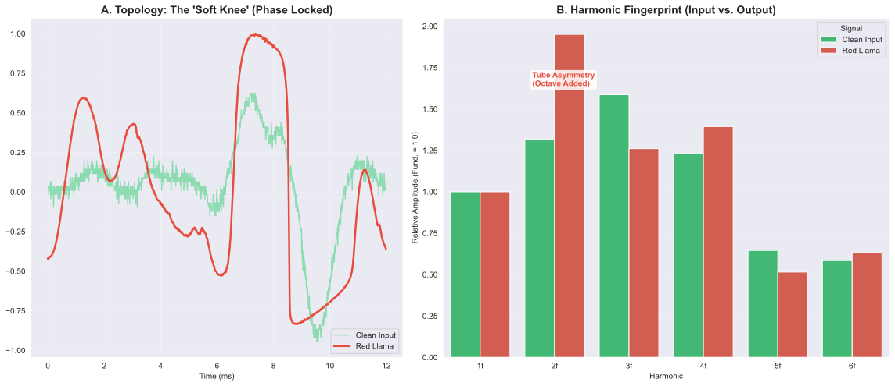
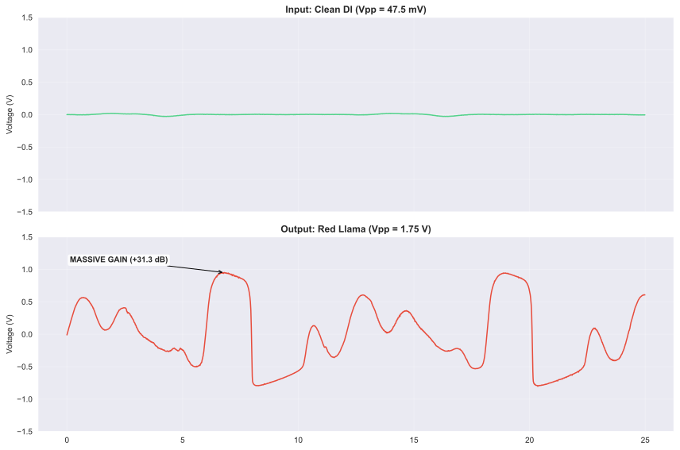
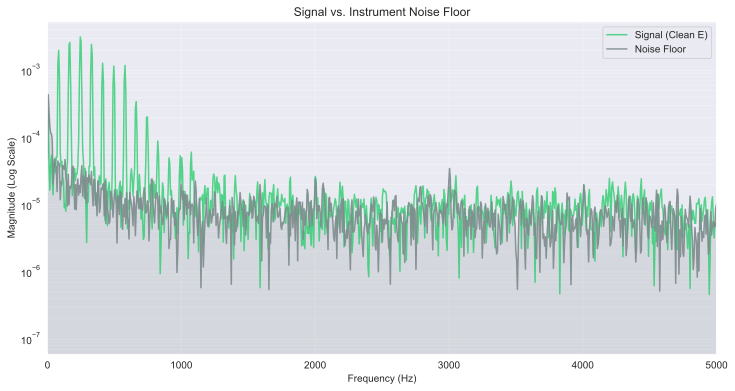

# Technical Report: From Python to Silicon

**[📄 Read the Full Engineering Report (PDF)](./systems_audio_tech_report.pdf)**

This directory contains the formal technical documentation for the **Universal RP2040 Analog Interface** and its associated subsystems. It serves as a comprehensive Systems Engineering Technical Report, detailing the recursive journey of building the software to buy the parts, building the power supply to run the device, and building the instrumentation to validate it.

---

## 1. The Engineering Narrative

The core objective of this project was to bridge the "Full-Stack Gap" between high-level software architecture and physical layer implementation. Rather than purchasing off-the-shelf components, four distinct systems were engineered to support one another:

1.  **Logistics (Star Ground):** A Python-based BOM engine to solve the procurement problem.
2.  **Infrastructure (Linear Regulator):** A thermal-managed 12V $\to$ 9V supply to establish a low noise floor.
3.  **Device Under Test (Red Llama):** A CMOS Hex Inverter-based overdrive circuit.
4.  **Instrumentation (RP2040 DAQ):** A custom **FFT Spectrum Analyzer** used to empirically validate the DUT.

## 2. Key Findings

The final analysis (detailed in **Chapter 6** of the report) successfully validated the "Tube-like" behavior of the CD4049 CMOS topology.

### A. Topology Confirmation (Soft Clipping)
* **Hypothesis:** CMOS inverters, when biased linearly, exhibit "Soft Knee" compression rather than the hard-clipping characteristic of silicon diodes.
* **Result:** Confirmed. The transfer characteristic follows a continuous **Hyperbolic Tangent ($\tanh$)** curve. The frequency domain (Right) reveals a dominant **2nd Harmonic (Octave)**, mathematically consistent with vacuum tube triode asymmetry.

### B. Signal Gain & Dynamic Range
* **Measurement:** The Red Llama circuit provides approximately **31dB** of gain ($36\times$).
* **Mechanism:** The circuit amplifies the ~50mV instrument signal until it physically collides with the power supply rails (0V / 3.3V). The density of the waveform below visualizes this massive amplification factor.

### C. System Sensitivity (Noise Floor)
* **Validation:** The custom Linear Power Regulator successfully eliminated 60Hz mains hum.
* **Metric:** The DAQ achieved a read noise RMS of **~1.3mV**, yielding a calculated Signal-to-Noise Ratio (SNR) of **42dB** relative to the saturated signal.

---

## 3. Active Development (Phase II)

The project has transitioned from passive capture to **Active Signal Injection**.
* **Signal Generation:** A new Python DDS engine (`scripts/signal/play_sweep.py`) utilizes the host DAC to generate precise frequency sweeps (20Hz-20kHz).
* **Objective:** Future analysis will utilize this "Laptop-as-Generator" topology to automate Bode plotting and THD profiling.

## 4. Artifacts

* **`systems_audio_tech_report.tex`**: The LaTeX source code for the technical report.
* **`figures/`**: Generated matplotlib exports from the analysis pipeline.
* **`systems_audio_tech_report.pdf`**: The compiled documentation.
