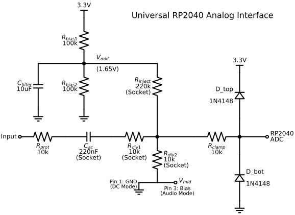

# Universal RP2040 Spectrograph & Oscilloscope

**Status:** Commissioned (Jan 2026) | **Revision:** 1.1 (System ID Upgrade)

This project transforms a Raspberry Pi RP2040-Zero into a precision, calibrated Data Acquisition (DAQ) device for high-fidelity audio and spectral analysis. Unlike standard ADC examples, this system features a custom Analog Front End (AFE) with bias injection, signal clamping, and a "Store-and-Forward" firmware architecture to decouple sampling stability from USB latency.

In **Phase 2**, the system was expanded to include a host-side **Function Generator** and **Transfer Function Analyzer**, allowing for closed-loop system identification (Bode plots, Linearity testing, and THD measurement).



*A more informational version of the schematic, along with an explanation of the circuit, can be found [here](./schematics/README.md).*

## ⚡ System Specifications

| Parameter | Performance |
| :--- | :--- |
| **ADC Depth** | 12-bit (Hardware) $\to$ 16-bit (Scaled) |
| **Sample Rate ($F_s$)** | **97.8 kHz** (Calibrated via 60Hz Mains Reference) |
| **Bandwidth** | DC -- 48.9 kHz (Nyquist) |
| **Buffer** | 16,384 Samples ($\approx 167$ms burst) |
| **Input Range** | 0--3.3V (Unipolar) / $\pm 3.3V$ (AC Coupled) |

## 📂 Repository Architecture

### [`schematics/`](./schematics/)
The physical layer. Contains the KiCad schematics and fabrication exports for the Universal AFE.
* **Topology:** Switched Reference with selectable attenuation (Line Level vs. High-Z/Guitar).
* **Protection:** Dual-stage clamping ($R_{prot}$ + 1N4148 diodes) prevents RP2040 latch-up.

### [`firmware/`](./firmware)
The MicroPython logic running on the MCU.
* **Engine:** Uses `@micropython.native` emitters for a jitter-free polling loop.
* **Protocol:** Implements a binary "Handshake" protocol (`s` for Science Burst, `v` for Video) to manage USB serial backpressure.

### [`src/`](./src)
The Python library backing the analysis pipeline.
* **`src.daq`**: Hardware abstraction for USB UART stream processing.
* **`src.audio`**: Host-side signal generation (Sine, Square, Log Sweeps) via `sounddevice`.
* **`src.dsp`**: Signal processing (FFT, THD, Triggering).
* **`src.analysis`**: Publication-ready plotting and reporting engines.

### [`scripts/`](./scripts)
User-facing tools for interaction.
* **`capture/`**: Headless recording tools.
    * `record.py`: High-fidelity bursts.
    * `measure_transfer.py`: Automated stimulus-response testing (Sweep/Steady).
* **`signal/`**: Interactive function generators.
    * `play_wave.py`: Infinite waveform generator with live scope.
    * `play_sweep.py`: Logarithmic sine sweep generator.
* **`visualization/`**: Real-time monitoring (`live_scope.py`) and rendering (`render_scope_video.py`).

### [`notebooks/`](./notebooks)
The scientific workbench.
* **`01_acquisition.ipynb`**: Hardware calibration and raw data inspection.
* **`02_analysis.ipynb`**: Empirical characterization of the Red Llama Overdrive (Harmonics & Topology).
* **`03_transfer_function.ipynb`**: System identification (Linearity & Frequency Response).

## Hardware Requirements
**Total Cost:** ~$4.14 USD

| Qty | Component | Notes |
| :--- | :--- | :--- |
| 1 | **RP2040-Zero** | Waveshare or generic. |
| 1 | **6.35mm Jack** | Mono (TS). |
| 4 | **10kΩ Resistors** | 1/4W 1% |
| 2 | **100kΩ Resistors** | 1/4W 1% |
| 1 | **220kΩ Resistor** | 1/4W 1% |
| 2 | **1N4148 Diodes** | Signal/Switching. |
| 1 | **220nF Capacitor** | Film/Box preferred. |
| 1 | **10µF Capacitor** | Electrolytic. |
| 1 | **Perfboard** | 40x60mm min. |

> *Full Bill of Materials with Tayda Electronics SKUs and pricing [available here](./schematics/README.md).*

## 🚀 Quick Start

### 1. Firmware Flash
Flash the RP2040 with MicroPython (v1.27+) and copy `firmware/main.py` to the root of the device.

### 2. Host Environment
Install dependencies (requires Python 3.10+):

```bash
uv sync
```

### 3. Execution

Real-Time Monitoring:
```bash
python scripts/visualization/live_scope.py
```

Function Generator (Signal + Scope):
```bash
python scripts/signal/play_wave.py
```

Automated Transfer Function Capture:
```bash
# Capture a 5-second log sweep for Bode plotting
python scripts/capture/measure_transfer.py sweep --duration 5 --amp 0.5
```