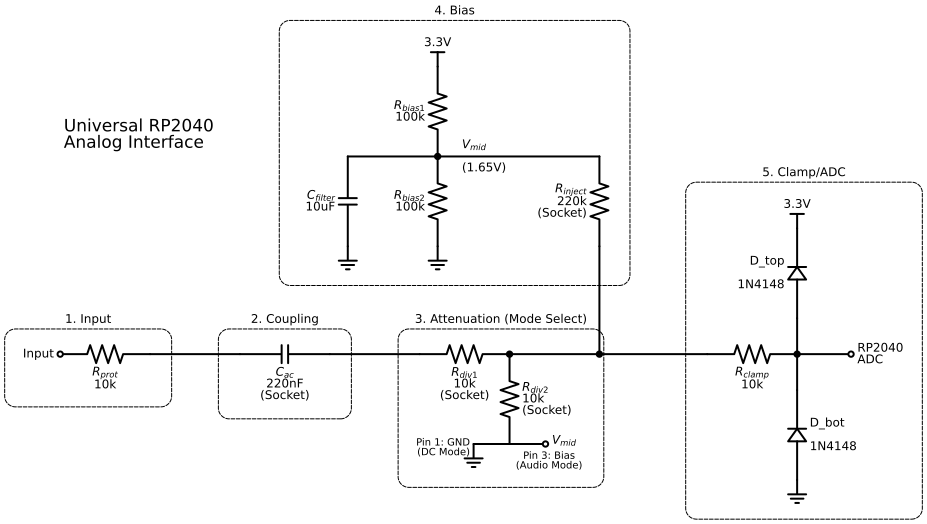

# Hardware: Universal RP2040 Signal Conditioning Interface

**Revision:** 1.0
**Status:** Fabricated & Validated

This directory contains the schematic capture, board layout, and bill of materials for the Universal Analog Front End (AFE). This hardware bridges the gap between high-amplitude bipolar AC signals (Eurorack, Line Level, Guitar) and the unipolar 0-3.3V ADC of the RP2040, providing necessary attenuation, biasing, and protection.

## Schematic & Theory of Operation

The circuit design is broken down into five distinct stages to ensure signal integrity and safety.

*See [`exports/`](./exports/) for PDF versions and the compact schematic view.*

### 1. Input Protection
**Component:** $R_{prot}$ ($10k\Omega$)

The input stage is the first line of defense. I placed a $10k\Omega$ series resistor immediately at the input jack. In the event of a high-voltage transient or accidental connection to a modular synth rail ($\pm 12V$), this resistor limits the current flowing into the clamping diodes, preventing thermal destruction of the protection stage.

### 2. AC Coupling (High-Pass Filter)
**Component:** $C_{ac}$ ($220nF$)

For audio analysis, we must block DC offsets to maximize dynamic range within the 3.3V rail. I selected a $220nF$ polyester film capacitor. The corner frequency ($f_c$) depends on the input impedance of the subsequent stage.

In **High-Z / Guitar Mode**, where input impedance is dominated by $R_{inject}$ ($220k\Omega$):
$$f_c = \frac{1}{2\pi R C} = \frac{1}{2\pi \cdot 220k\Omega \cdot 220nF} \approx 3.29 Hz$$

This ensures a flat response well below the audible floor (20Hz). Even in low-impedance attenuation modes, the cutoff remains acceptable for spectral analysis.

### 3. Attenuation & Mode Selection
**Components:** $R_{div1}$, $R_{div2}$, Jumper Header

This stage defines the gain structure. By socketing $R_{div1}$ and $R_{div2}$, the attenuation ratio ($A_v$) can be tuned for specific sources (e.g., 0.1x for Modular, 0.5x for Line Level).

I implemented a **Switched Reference Topology** here to solve a critical impedance conflict. Initially, tying $R_{div2}$ to Ground while injecting bias separately created a parasitic voltage divider that collapsed the bias voltage.

* **Audio Mode:** The jumper connects the bottom of $R_{div2}$ to $V_{mid}$ ($1.65V$). The signal "sees" virtual ground, preserving the gain ratio.
* **DC Mode:** The jumper connects to GND, forming a standard resistive divider for unipolar sensing (0-5V sensors).

### 4. Bias Network
**Components:** $R_{bias1}$, $R_{bias2}$, $C_{filter}$, $R_{inject}$

The RP2040 ADC requires a signal centered at $1.65V$ (half-rail) to read AC waveforms. I used a stiff voltage divider ($100k\Omega$ pair) filtered by a $10\mu F$ electrolytic capacitor to generate a stable quiet rail ($V_{mid}$).

* **For High-Z Instruments:** We leave the attenuator sockets empty and install $R_{inject}$ ($220k\Omega$) to weakly bias the signal without loading the guitar pickups.
* **For Line Sources:** We remove $R_{inject}$ and rely on the Switched Reference connection at Stage 3.

### 5. Clamping & ADC Driver
**Components:** $D_{top}$, $D_{bot}$, $R_{clamp}$

The final stage protects the microcontroller silicon. Two 1N4148 switching diodes hard-clamp the signal voltage to the rails (plus forward voltage drop, $\approx -0.3V$ to $3.6V$). A final $10k\Omega$ resistor ($R_{clamp}$) limits current into the ADC's internal sampling capacitor, protecting against latch-up conditions if the clamping diodes are momentarily overwhelmed.

---

## Bill of Materials (BOM)

### Passive Components

| Schematic Ref | Value | Component Type | Stock SKU | Price (Unit) | Notes |
| :--- | :--- | :--- | :--- | :--- | :--- |
| **$R_{prot}$** | 10kΩ | Resistor 1/4W 1% | **A-2203** | \$0.015 | Input protection. |
| **$C_{ac}$** | 220nF | Polyester Box Cap | **A-565** | \$0.14 | **Socket This.** Audio coupling. Swap for Wire in DC mode. |
| **$R_{div1}$** | 10kΩ | Resistor 1/4W 1% | **A-2203** | \$0.015 | **Socket This.** Top of attenuator. |
| **$R_{div2}$** | 10kΩ | Resistor 1/4W 1% | **A-2203** | \$0.015 | **Socket This.** Bottom of attenuator. |
| **$R_{inject}$** | 220kΩ | Resistor 1/4W 1% | **A-2329** | \$0.015 | **Socket This.** Only used in High-Z / Guitar Mode. |
| **$R_{bias1}$** | 100kΩ | Resistor 1/4W 1% | **A-2248** | \$0.015 | Top of bias divider (3.3V). |
| **$R_{bias2}$** | 100kΩ | Resistor 1/4W 1% | **A-2248** | \$0.015 | Bottom of bias divider (GND). |
| **$C_{filter}$** | 10µF | Electrolytic Cap | **A-4554** | \$0.02 | Filters the $V_{mid}$ rail. Watch Polarity! |
| **$R_{clamp}$** | 10kΩ | Resistor 1/4W 1% | **A-2203** | \$0.015 | Final current limiter before ADC. |
| **$D_{top}$** | 1N4148 | Switching Diode | **A-157** | \$0.01 | Clamps signal to 3.3V. |
| **$D_{bot}$** | 1N4148 | Switching Diode | **A-157** | \$0.01 | Clamps signal to GND. |

### Hardware & Connectors

| Component | Description | Stock SKU | Price (Unit) | Usage |
| :--- | :--- | :--- | :--- | :--- |
| **RP2040-Zero** | Raspberry Pi Module | **A-8128** | \$2.29 | The brain. |
| **Input Jack** | 6.35mm (1/4") Mono Socket | **A-4556** | \$0.77 | Main signal input. |
| **SIP Sockets** | 40 Pin SIP Socket Adaptor | **A-1605** | \$0.39 | Cut to size for socketed components ($R_{div}$, $C_{ac}$). |
| **Mode Jumper** | 3-Pin Male Header + Shunt | *Generic* | N/A | Selector for Audio ($V_{mid}$) vs DC (GND). |
| **Perfboard** | 40x60mm Double Sided | **A-1193** | \$0.40 | Main substrate. |

#### Project Total: $4.14

### Socket Breakdown
To facilitate the modular design, cut the 40-pin header strip into the following sections:
* **1x2 Pin:** For $C_{ac}$
* **1x2 Pin:** For $R_{div1}$
* **1x2 Pin:** For $R_{div2}$
* **1x2 Pin:** For $R_{inject}$

---

## Configuration Guide

The board functionality is determined by the socketed components and the position of the 3-pin jumper.

| Mode | Application | Jumper (JP1) | $R_{div1}/R_{div2}$ | $R_{inject}$ |
| :--- | :--- | :--- | :--- | :--- |
| **Audio (Std)** | Synths, Pedals | Pin 2-3 ($V_{mid}$) | 10k / 10k | *Empty* |
| **Guitar (High-Z)** | Passive Inst. | Pin 2-3 ($V_{mid}$) | Wire / *Empty* | 220k |
| **DC / Sensor** | 0-5V Signals | Pin 1-2 (GND) | 10k / 10k | *Empty* |

## Assembly & Calibration Notes

1.  **Ground Loops:** If connecting to mains-powered gear (like guitar pedalboards), power the RP2040 from an isolated laptop (battery mode) to avoid creating a ground loop with the building mains.
2.  **Diodes:** Observe polarity. The **Black Band** (Cathode) on $D_{top}$ points to 3.3V. The **Black Band** on $D_{bot}$ points to the Signal Line.
3.  **Electrolytic Cap:** The **White Stripe** (Negative) on $C_{filter}$ must connect to Ground.
4.  **RP2040 Installation:** Install headers on a breadboard first, place the RP2040 on top, and solder. This ensures the pins remain perfectly vertical and aligned.

### Sample Rate Calibration
The RP2040 internal clock is stable, but MicroPython overhead introduces deterministic latency. To calibrate the exact sampling rate ($F_s$) without an external function generator:
1.  Touch the tip of the input jack to couple 60Hz mains hum from the environment.
2.  Run the FFT analysis script.
3.  Measure the offset of the peak from 60.0Hz.
4.  Apply the scalar correction factor $\alpha = \frac{60.0}{f_{meas}}$.

*For this specific build, the calibrated $F_s \approx 97.8 kHz$.*